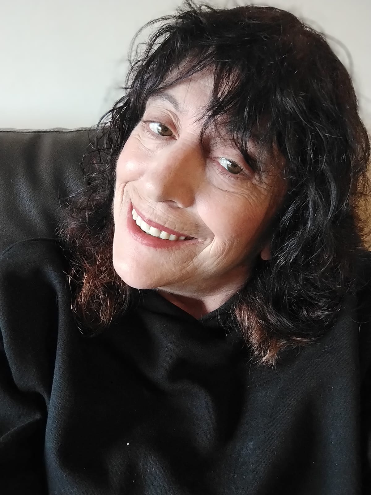

# Programación con objetos I
## Presentación

### Datos Personales
Hola, soy Norma Gomez. Tengo 64 años y estoy estudiando programación porque quiero reinventarme y abrir nuevos caminos. 
Vengo del mundo de la consultoría e investigación de mercados, pero siempre tuve curiosidad por la tecnología y ahora me animé a dar este paso. 
Me gusta aprender, compartir experiencias y seguramente vamos a crecer mucho juntos en esta carrera.

### Algunas otras cosas
Me apasiona leer y disfruto mucho escribiendo poemas.
A lo largo de mi vida tuve que asumir muchas responsabilidades familiares, pero hoy tengo la posibilidad de elegir qué hacer, y eso me ilusiona profundamente.
Decidí empezar por estudiar en una universidad que me maravilla cada día.

